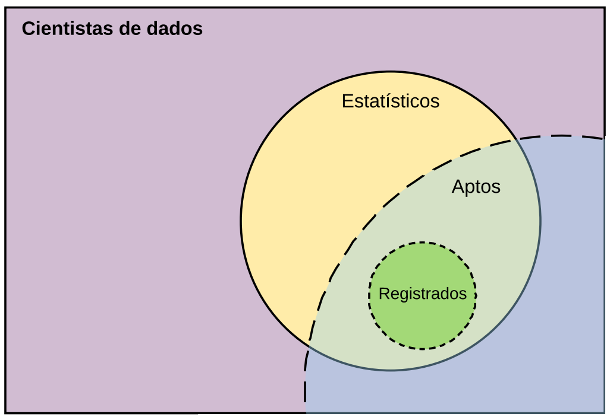
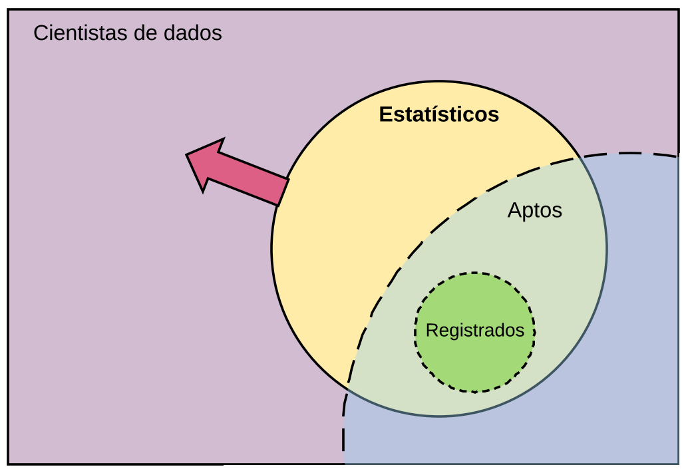

```{r, include=FALSE}
knitr::opts_chunk$set(echo=FALSE, warning=FALSE, 
                      message=FALSE, out.width = "90%")
```

# A. Assuntos gerais

## Integrantes do conselho

- **Presidente**: Julio Trecenti
- **Vice-Presidente**: Doris Fontes
- **Tesoureiro**: Marcelo Ventura

### Conselheiros Efetivos

Adriana Silva, Edmar Alvarenga, Ines Nishimoto, Marcos Coque, Mario Tarumoto, Nathalia Demetrio.

### Conselheiros Suplentes

Alessandro Zito, Fernanda Rosa, Marcelo Fernandes, Mauro Alves, Nara Spall, Newton Nogueira, Paula Bonifácio, Paulo Ferreira, Regina Albanese.

## Contexto

```{r}
knitr::include_graphics("img01.png")
```

## Contexto

```{r}

```

### O que queremos?

## O que queremos

### Aumentar registros

```{r}
knitr::include_graphics("img03.png")
```

## O que queremos

### Aumentar estatísticos

```{r}

```

## O que queremos

### Trazer os cientistas de dados

```{r}
knitr::include_graphics("img05.png")
```

## O que sabemos?

### Estatísticos registrados

```{r}
knitr::include_graphics("img06.png")
```

## Plano CONRE-3 de 2018

### Plano canônico

- Participar das colações, recepções e semanas da estatística.
- Realizar eventos: II CONE 2018 e XIV Encontro Estatístico.
- Manter trabalhos de registro e prestação de contas.
- Manter a comunicação operante.

### Metas de expansão

- Simplificar fluxo de registro no conselho.
- Melhorar bases de dados de estatísticos.
- Aumentar equipe de comunicação.

# B. Assuntos específicos

## Carteira provisória para graduandos

### Resolução relacionada: 057/1976, art.4

### Problema

1. Custo alto (50% da anuidade).
1. Resoluções não estão claras.

### Solução

1. Valor simbólico: $20, renovável.

### Vantagens
  
1. Alimenta base de dados.
2. Aumenta probabilidade de registro definitivo.

<!-- -------------------------------------------------------------- -->

## Desconto para recém formados

### Problema

1. Baixa quantidade de registros (< 15%)
1. Alegam não ter dinheiro/emprego

### Solução

1. Desconto de 20-40% da anuidade.

### Vantagens

1. Aumenta probabilidade de registro definitivo.
1. Aumenta receita.

## Desconto para recém formados

```{r, fig.width=9, fig.height=4}
library(tidyverse)
c_tot <- 359.47 + 228.17
prop_reg <- 0.1
formandos <- 120

prop_reg_desc <- function(desconto, k) {
  pmin(1, prop_reg + desconto * k)
}
arrecadacao_total <- function(desconto, cenario) {
  formandos * c_tot * prop_reg_desc(desconto, cenario) * (1 - desconto)
}
dados <- list(desconto = seq(0, 1, 0.001), 
              cenario = c(0:15/10)) %>%
  cross_df() %>% 
  mutate(prop_registrados = prop_reg_desc(desconto, cenario),
         arrecadacao_total = arrecadacao_total(desconto, cenario)) %>% 
  mutate(lab = factor(scales::percent(cenario / 100)),
         lab = fct_reorder(lab, cenario)) %>% 
  group_by(cenario) %>% 
  mutate(m = desconto[which.max(arrecadacao_total)])

dados %>% 
  count(m) %>% 
  ungroup() %>% 
  mutate(labs = scales::percent(cenario/100) %>% 
           fct_reorder(cenario)) %>% 
  ggplot(aes(x = labs, y = m, fill = m^2)) +
  geom_col() +
  guides(fill = FALSE) +
  theme_minimal(16) +
  scale_y_continuous(labels = scales::percent) +
  labs(x = "1% de desconto vale quantos % de aumento nos registrados?",
       y = "Valor ótimo de desconto")
```

<!-- -------------------------------------------------------------- -->

## Criação de comissão para melhoria contínua do CNE

### Problema

1. Variáveis faltantes na base de dados.
1. Indivíduos faltantes na base de dados.

### Solução

1. Criar comissão com representantes CONFE e CONRE para 
    1. Definir prioridades.
    1. Definir cronograma de implementação.
    1. Acompanhar implementação.

### Vantagens

1. Descentraliza gestão do sistema
1. Acelera melhorias

<!-- -------------------------------------------------------------- -->

## Registro de docentes e empresas júnior

### Problema

1. Outra categoria profissional.
1. EJ's precisam de estatístico responsável.
1. Necessidade de nos aproximar de docentes.

### Solução

1. Oferecer registro simbólico, $50 por ano.
1. Oferecer vantagens, como descontos em eventos.

### Vantagens

1. Melhora relação Conselho <-> academia
1. Melhora relação Conselho <-> EJ's
1. Boas relações aumentam conversão.

<!-- -------------------------------------------------------------- -->

## Alternativas para multa eleitoral

### Problema

1. Multa eleitoral é cara 
    - CRBio: 20% ($102), Cremesp: $74, 
    - CAU: 5% ($27), CRECI: 100% ($591), CRCSP: 50% ($97)
    - **CONRE**: 50% ($180)
1. Taxa de inadimplência é alta (>50%).
1. Hipótese: multa aumenta probabilidade de inadimplência.

### Solução

1. Reduzir multa para inadimplentes para 20%.

### Vantagens

1. Hipótese: aumenta a probabilidade de quitar dívida.
1. Retorno financeiro.

<!-- -------------------------------------------------------------- -->

## Resolução para permitir baixa temporária

### Problema

1. Afeta pessoas desempregadas ou fora do Brasil (e.g. doutorado-sanduíche).
1. Não há previsão em resolução.

### Solução

1. Criar resolução que cancela anuidade por um ano, mediante pedido.

### Vantagens

1. Reduz a probabilidade de pedidos de baixa definitiva.

<!-- -------------------------------------------------------------- -->

# C. Fluxo de trabalho

## Forma de comunicação

- **Discussões**
    - *Informal*: Whatsapp: (11) 98091-0048
    - *Formal*: E-mail: info@conre3.org.br, jtrecenti@conre3.org.br

- **Reuniões**
    - *Mensais*: appear.in, skype (@jtrecenti), hangouts
    - *Semestrais*: reunião presencial

## Aprovação de resoluções

### Problema

1. Falta dinamismo no fluxo de elaboração de resoluções

### Solução

1. Passados 15 dias do informativo, aprovar decisões dos CONRE's tacitamente.

### Vantangens

1. Acelera a resolução de problemas.
1. Incentiva comunicação.

## Agenda 2018

- CONE 2018: 08 e 09 de junho.
- Encontro estatístico: novembro.
- Primeira plenária do CONRE-3: 10/01/2018.
- Próxima reunião CONFE/CONRE-3:
