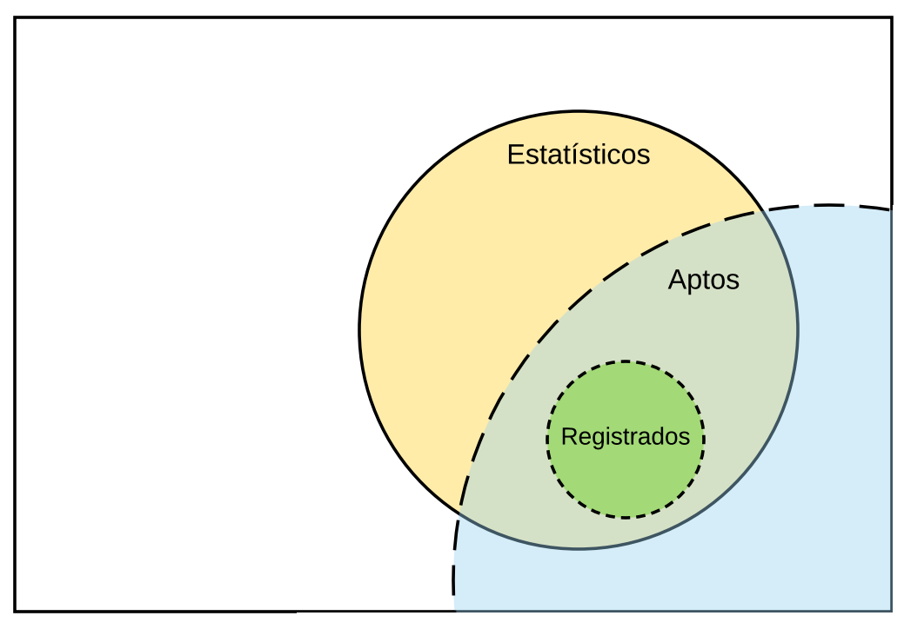
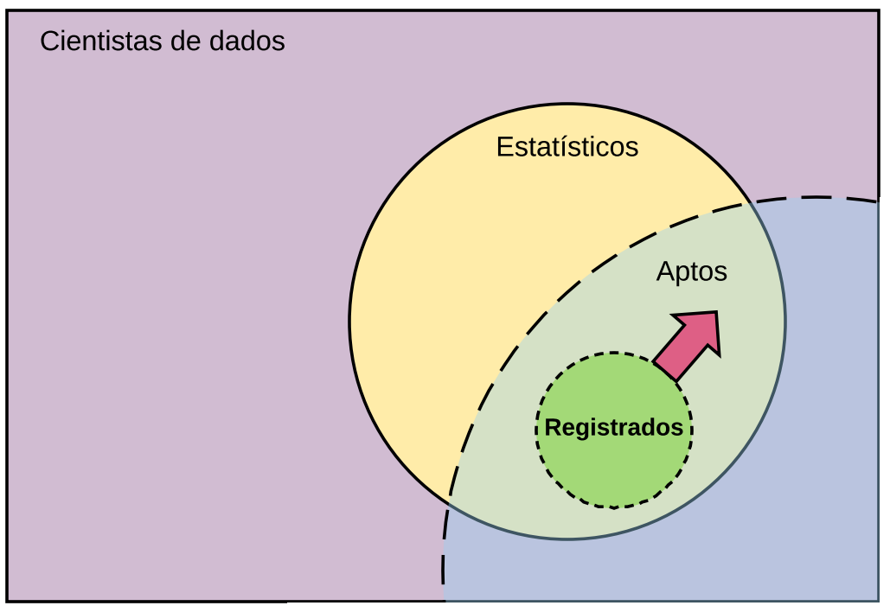
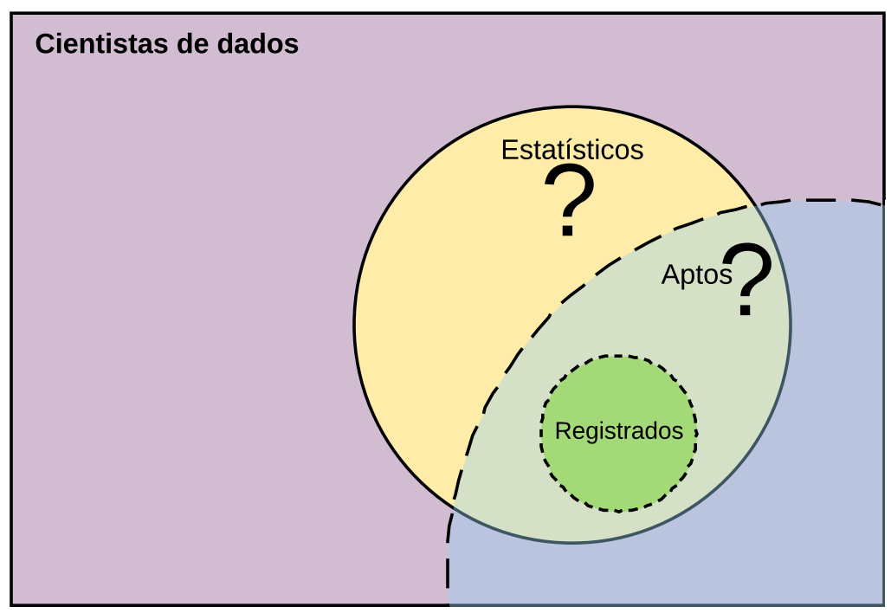

```{r, include=FALSE}
knitr::opts_chunk$set(echo=FALSE, warning=FALSE, 
                      message=FALSE, out.width = "90%")
```

# A. Assuntos gerais

## Contexto

```{r}

```

## Contexto

```{r}
knitr::include_graphics("img02.png")
```

### O que queremos?

## O que queremos

### Aumentar registros

```{r}

```

## O que queremos

### Aumentar estatísticos

```{r}
knitr::include_graphics("img04.png")
```

## O que queremos

### Trazer os cientistas de dados

```{r}

```

## O que sabemos?

### Estatísticos registrados

```{r}

```

## Plano CONRE-3 de 2018

### Direção

1. Facilitar e incentivar a associação de bacharéis e técnicos em estatística.
1. Aumentar a quantidade de pessoas que podem se associar.
1. Aproximar o conselho dos cientistas de dados não-estatísticos.

## Plano CONRE-3 de 2018

### Plano canônico

- Participar das colações, recepções e semanas da estatística.
- Realizar eventos: II CONE 2018 e XIV Encontro Estatístico.
- Manter trabalhos de registro e prestação de contas.
- Manter a comunicação operante.

### Metas de expansão

- Simplificar fluxo de registro no conselho.
- Melhorar bases de dados de estatísticos.
- Colaborar com a criação de cursos técnicos.
- Aumentar equipe de comunicação.
- Criar equipe de fiscalização.

# B. Comissões

## Integrantes do conselho

- **Presidente**: Julio Trecenti
- **Vice-Presidente**: Doris Fontes
- **Tesoureiro**: Marcelo Ventura

### Conselheiros Efetivos

Adriana Silva, Edmar Alvarenga, Ines Nishimoto, Marcos Coque, Mario Tarumoto, Nathalia Demetrio.

### Conselheiros Suplentes

Alessandro Zito, Fernanda Rosa, Marcelo Fernandes, Mauro Alves, Nara Spall, Newton Nogueira, Paula Bonifácio, Paulo Ferreira, Regina Albanese.


## Estrutura

```{r}

```


## CEA - Ensino e Aperfeiçoamento

- **Pra quê**: Aumentar estatísticos, melhorando a base e reduzindo evasão.
- **Metas**: Realizar workshops, elaborar vocalização, elaborar material.
- **Pessoas**:
    - **Presidente**: Regina.
    - **Membros**: Adriana, Newton, Doris, Marcelo F, Paulo, Mario.

## CCT - Comunicação e Tecnologia

- **Pra quê**: Aumentar conversões,  e aumentando relevância nas redes.
- **Metas**: Facilitar fluxo de registro, explodir nas redes, melhorar site.
- **Pessoas**:
    - **Presidente**: Fernanda.
    - **Membros**: Nathalia, Nara, Marcelo V, Mauro, Doris, Julio, Paula.

## CED - Eventos e Divulgação

- **Pra quê**: Aumentar visibilidade, acessar mais pessoas.
- **Metas**: Fazer eventos, expandir a comunicação, engajar todo mundo, aumentar nossa equipe.
- **Pessoas**:
    - **Presidente**: Adriana
    - **Membros**: Adriana, Nathalia, Marcos, Julio, Marcelo V, Marcelo F, Mario.

## CEFP - Ética e Fiscalização Profissional

- **Pra quê**: Aumentar relevância, cumprir a função do Conselho
- **Metas**: Listar empresas a serem autuadas, elaborar metodologia de fiscalização.
- **Pessoas**:
    - **Presidente**: Edmar.
    - **Membros**: Zito, Ines, Nara. 

## CTCO - Tomada de Contas e Orçamento

- **Pra quê**: Cumprir o regimento interno do Conselho.
- **Metas**: Prestar contas para o TCU.
- **Pessoas**: 
    - **Presidente**: Mario
    - **Membros**: Ines, Paula, Edmar, Ricardo.

## CPL - Permanente de Licitação

- **Pra quê**: Contratar pessoas, fazer licitações.
- **Metas**: Contratar advogado, estagiário e equipe de comunicação.
- **Pessoas**: 
    - **Presidente**: Julio
    - **Membros**: Ricardo, Vitor, Mauro

# C. Agenda e tarefas

## Agenda 2018

- Datas
    - CONE: 08 e 09 de junho.
    - Encontro estatístico: novembro.
    - Plenárias: Quarta à noite, 1x por mês.
    - Eventos: na agenda
- Fluxo
    - Tarefas: todoist
    - Discussão: Whatsapp / Telegram
    - Julio no CONRE: quarta-feira

## Divisão de tarefas: registro

- Formulário: Julio
- Reuniões com empresas: Adriana
- Convênios com faculdades: Nathalia / Julio
- Carteira técnica para graduandos, se funcionar: ?
- ...

## Divisão de tarefas: CONE 2018

- Local
- Coffee
- Conteúdo / Palestrantes
- Prêmio
- ...

## Relato reunião com CONFE

- Carteira técnica para graduandos
    - Bem visto, vamos mandar minuta e discutir $
- Desconto para recém formados
    - Bem visto, vamos mandar minuta e discutir $
- Criação de comissão para melhoria contínua do CNE
    - Bem visto, precisamos pressionar
- Registro de docentes e empresas júnior
    - Não existe consenso no CONFE, precisamos fazer muitos follow-ups
- Alternativas para multa eleitoral
    - Não deu pra tirar nenhum resultado, mas vamos mandar minuta.
- Resolução para permitir suspensão temporária
    - Mal visto, vai ser difícil virar, mas vamos mandar minuta.
- Forma de comunicação
    - Skype é muito difícil (!!!)
    - tentar passar resolução de aprovação tácita

## Outros assuntos

- SINAPE 2018.
- Agenda de Recepção, colação e semanas.
